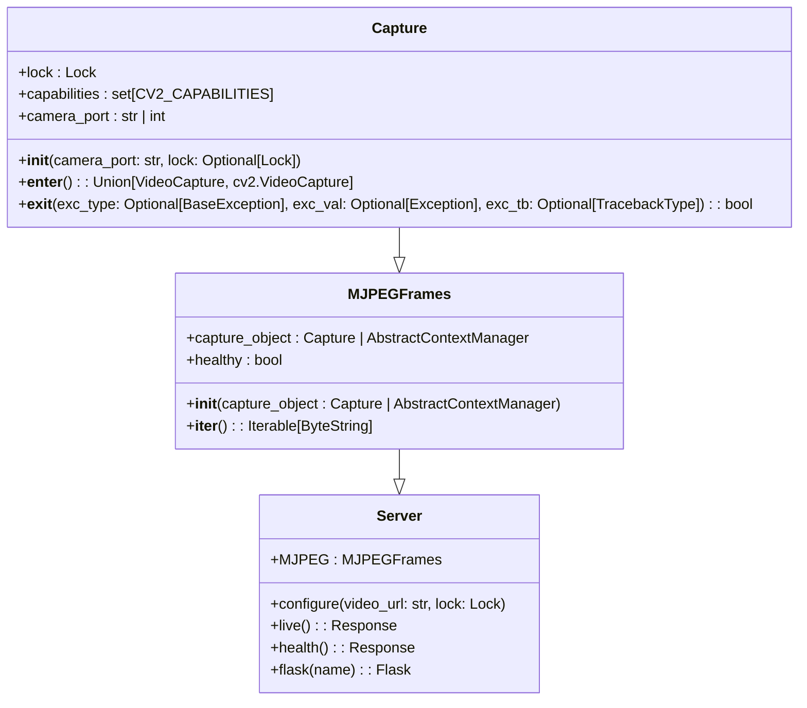

# OpenCV MJPEG Server

## Develop with

Please install the development version while developing with the library, as it includes a typechecker.

```sh
python3 -m pip install ".[DEVELOPMENT]"
```

### Basic Usage

```python
from flask import Flask, Response
from mjpegazer import Capture, MJPEGFrames

app = Flask(__name__)

@app.route("/live")
def live() -> Response:
    video_stream = Capture(
        "http://webcam.rhein-taunus-krematorium.de/mjpg/video.mjpg",
    )

    mjpeg_frames = MJPEGFrames(video_stream)
    return Response(
        mjpeg_frames,
        mimetype="multipart/x-mixed-replace; boundary=frame",
    )


if __name__ == "__main__":
    app.run(host="127.0.0.1", port=5000)
```


### Enable type checking

Set the environment variable `DEBUG` to `True`

```sh
export DEBUG=True
```

> Or from Python (before the import)
>
> ```python
> from os import environ
> 
> environ["DEBUG"] = "True"
>
> from mjpegazer import ...
> ```

## Tests

Run the unittests

```sh
python3 -m unittest discover tests/
```

## Core Logic



### Capture

> file: [mjpegazer/core/capture.py](../mjpegazer/core/capture.py)

The `Capture` class is a context manager designed to handle the video capturing process from a specified camera port. This class provides an easy and efficient way of capturing video from different sources with ensured resource cleanup after usage.

#### Attributes

- `_port: str`: The camera port that this Capture instance connects to. This could be a string representing a URL or an integer representing a hardware port.

- `lock: Lock`: A `Lock` object used in multithreading scenarios to prevent simultaneous access to shared resources.

- `capabilities: set[CV2_CAPABILITIES]`: This attribute represents the capabilities of the video capture device. It currently defaults to `{cv2.CAP_FFMPEG}`.

- `_capture: cv2.VideoCapture | None`: An instance of `cv2.VideoCapture` used to capture frames from the video source. Initialized as `None`.


#### Example

```python
with Capture("my video url") as cap:
    while cap.isOpened():
        ret, frame = cap.read()
        ...
```

#### Implement one yourself:

Please see [mjpegazer/core/capture.py](../mjpegazer/core/capture.py)

The basic gist of what you need is a context manager that on-up `__enter__()`: returns an initialized `cv2.VideoCapture`, or something else with the methods:
- isOpened() - must return a 'True/False' statement, i.e. `while cv2.VideoCapture().isOpened()`
- read() - must return a `Tuple` of (`True`, `np.ndarray[int, np.generic]`,) or (`False`, `Any | None | "is ignored"`)
- release() - can return `Any` (return not used)

### MJPEGFrames

> file: [mjpegazer/core/mjpeg.py](../mjpegazer/core/mjpeg.py)

Before diving into `MJPEGFrames`, let's first understand MJPEG:

MJPEG stands for Motion-JPEG, a video compression format where each video frame (or interlaced field of a video image) is separately compressed as a JPEG image. It's a sequence of JPEG frames without motion compression.

Now, let's delve into the `MJPEGFrames` class

#### Attributes

1. `capture_object: Capture | AbstractContextManager`: This attribute is the object that handles the capture of video data. It could be either the a fore mentioned `Capture` object or an object that is a context manager for handling the capture process. This object would be passed to the `__init__` function when creating an instance of the `MJPEGFrames` class.

2. `__init__(self, capture_object: Capture | AbstractContextManager) -> None`: The initializer for the `MJPEGFrames` class, which takes a `Capture` object or a an other cv2.VideoCapture context manager object as an argument. It sets up the `MJPEGFrames` object to start yielding frames from the video source.

3. `__iter__(self) -> Iterable[ByteString]`: This method defines `MJPEGFrames` as an iterable object, meaning you can loop over it to retrieve each frame in sequence. Each iteration yields a byte string with a header with a `--frame` boundry and the frame in the body

4. `healthy(self) -> bool`: This property returns a boolean indicating the health status of the `MJPEGFrames` instance. Each time a frame capture fails, a failure counter increments by 1. If this counter exceeds a predefined limit (as defined in [mjpegazer/utils/constants.py under `HEALTH_THRESHOLD`](../mjpegazer/utils/constants.py)), the `healthy` property will return `False`, indicating an unhealthy status. However, the counter resets to 0 as soon as a new frame is successfully captured, restoring the `healthy` status to `True`.

As such, an instance of `MJPEGFrames` essentially represents a stream of http MJPEG frames from a video source (accessible by iterating over the object).


#### Example

```python
from flask import Flask, Response
from mjpegazer import Capture, MJPEGFrames

app = Flask(__name__)

@app.route("/live")
def live() -> Response:
    video_stream = Capture(
            "my video url"
    )
    mjpeg_frames = MJPEGFrames(video_stream)
    return Response(
        mjpeg_frames,
        mimetype="multipart/x-mixed-replace; boundary=frame",
    )

if __name__ == "__main__":
    app.run(host="127.0.0.1", port=5000)
```


### Server

> file: [mjpegazer/core/rest.py](../mjpegazer/core/rest.py)

The `Server` class in this Flask application acts as the server setup and control center. It configures the video stream, provides access to the live video, reports the health status, and manages the Flask app creation and route setup.

#### Attributes

- `MJPEG: MJPEGFrames`: An instance of the `MJPEGFrames` class, which represents a stream of MJPEG frames from a video source.

#### Methods

- `configure(cls, video_url: str, lock: Lock = LOCK)`: This class method sets up the MJPEG stream. It does this by creating a `Capture` object with the provided video URL and lock, and then creating an `MJPEGFrames` object with this `Capture` object. The resulting `MJPEGFrames` object is stored in `cls.MJPEG`.

- `live(cls) -> Response`: This class method is a route handler that returns a `Response` object. The `Response` streams the MJPEG video frames as multipart/x-mixed-replace with boundary frame.

- `health(self) -> Response`: This class method is another route handler. It checks the health of the `MJPEGFrames` object and returns a `Response` object. If the `MJPEGFrames` object is healthy, the `Response` object will contain "True" with a status code of 200. Otherwise, it will contain "False" with a status code of 503.

- `flask(cls, name) -> Flask`: This class method creates a new Flask app with the given name. It adds "/live" and "/health" as URL rules, with `cls.live` and `cls.health` as the corresponding view functions, respectively. The newly created Flask app is returned.

#### Example

```python
from mjpegazer import Server

Server.configure("my video url")
app = Server.flask(__name__)

if __name__ == "__main__":
    app.run(host="127.0.0.1", port=5000)
```

### Other Notes

1. as OpenCV is not threadsafe (should be, yet doesn't handle it well when multiple `read()` calls are being made to the same object) and I don't want to increase the complexity of the project, I have limited the capabilities to 1 viewer per instance. if 2 (or more) try to view at the same time, the 2nd will have to wait until the first disconnects
  > This limitation only goes for the default implementation, the example at [Basic Usage](#basic-usage) does not suffer this limitation as a `Capture` and `MJPEGFrames` object is create per call to the method.
